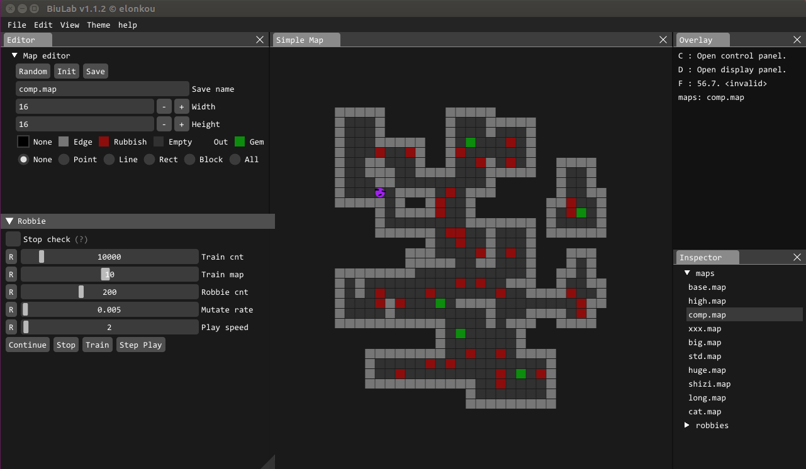
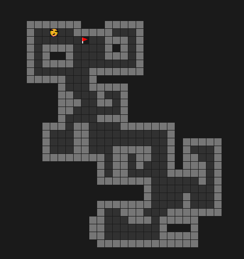
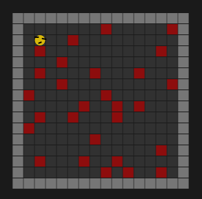

# BiuLab

## 1. What is BiuLab?

This is a platform for doing interesting experiments. 
The BiuLab was designed based on plugin architecture, you can create your own modules by c/c++/cuda, then controll it by your display window.



## 2.What can Biulab do?
### 2.1 Maze module. 


### 2.2 Robbie module. 


## 3.How to install Biulab.
```bash
# 3.1 ubuntu install (for ubuntu 18.04)
sudo apt-get install libglfw3 libglfw3-dev libglfw3-doc
sudo apt-get install libglew-dev

# 3.2 ubuntu install (for ubuntu 16.04, glfw3.2+)
# please install libglfw3/libglfw3-dev/libglfw3-doc.
sudo apt-get  install libglew-dev

# 3.3 build BiuLab (The default install path is install/bin on your source dir, you can change it in CMakeLists.txt)
cd biulab
mkdir build
cd build
cmake ..
make
make installl

# 3.4 build modules (The default install path is install/bin on your source dir, you can change it in modules/CMakeLists.txt)
cd modules/
mkdir build
cd build
cmake ..
make
make installl

# 3.5 run biulab
cd install/bin
./biulab
```
